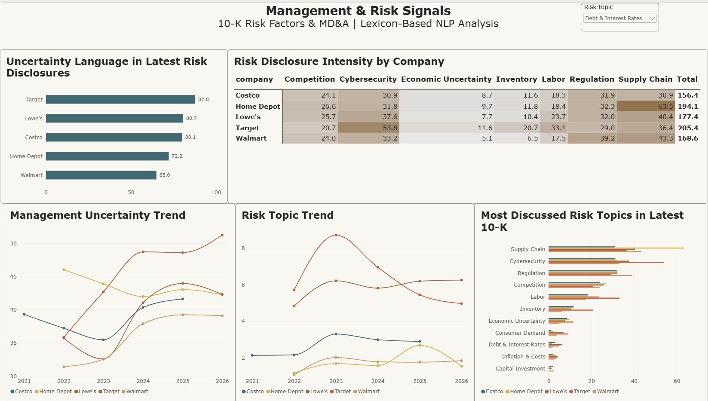

# Corporate Credit & Debt Capacity Analysis

A corporate credit risk project evaluating the debt repayment capacity of five major U.S. retailers using SEC financial data, Python, SQL, Excel, stress testing, Power BI, and qualitative 10-K risk analysis.

The project combines traditional borrower analysis with a lexicon-based NLP layer to examine what companies are discussing in their Risk Factors and Management Discussion & Analysis sections.

## Business Question

If a bank were considering lending to Walmart, Target, Costco, Home Depot, and Lowe's, which companies demonstrate the strongest ability to repay debt, and which carry greater credit risk?

## Companies Analyzed

- Walmart
- Target
- Costco
- Home Depot
- Lowe's

## Project at a Glance

| Area | Scope |
|---|---|
| Companies | 5 major U.S. retailers |
| Financial history | 5 fiscal years per company |
| Financial observations | 25 company-year records |
| 10-K filings analyzed | 25 |
| Credit metrics | 10+ |
| Stress scenarios | Base, Moderate, Severe |
| NLP sections | Item 1A Risk Factors + Item 7 MD&A |
| Power BI pages | 5 |

## Tools

**Python | pandas | requests | BeautifulSoup | SEC EDGAR | DuckDB | SQL | Excel | Power BI | Git**

---

## Data Collection & Preparation

Financial statement data was collected from SEC EDGAR filings and standardized across five companies.

The final historical dataset contains **25 company-year observations** covering:

- Revenue
- Operating Income
- Net Income
- Cash
- Current Assets
- Current Liabilities
- Total Assets
- Total Debt
- Shareholders' Equity
- Operating Cash Flow
- Capital Expenditure
- Interest Expense
- Depreciation & Amortization

Python was used for SEC data extraction, cleaning, XBRL tag validation, historical consistency checks, and preparation.

DuckDB and SQL were then used to calculate credit metrics and compare borrower performance across the peer group.

---

## Credit Metrics

The credit analysis evaluates each company across profitability, liquidity, leverage, cash generation, and debt-service capacity.

Key metrics include:

- Revenue Growth
- Operating Margin
- Free Cash Flow
- Current Ratio
- Debt-to-Equity
- Interest Coverage
- EBITDA
- Debt / EBITDA
- Operating Cash Flow / Debt
- Free Cash Flow / Debt
- Cash Flow Stability

Negative shareholders' equity is treated as a leverage risk rather than allowing a negative Debt-to-Equity ratio to artificially improve a company's credit profile.

---

## Credit Scoring Model

Each company is evaluated across seven credit dimensions:

| Dimension | Weight |
|---|---:|
| Leverage | 25% |
| Interest Coverage | 20% |
| Free Cash Flow / Debt | 20% |
| Cash Flow Stability | 15% |
| Liquidity | 10% |
| Profitability | 10% |

The model produces a relative credit score from **1 to 5**.

Stress-test performance is evaluated separately and incorporated into the final borrower ranking.

> These scores are analytical outputs created for this project and are not external credit-agency ratings.

---

## Stress Testing

Three scenarios were modeled to evaluate how borrower debt-service capacity changes under deteriorating business conditions.

| Scenario | Revenue Shock | Margin Shock | Interest Expense |
|---|---:|---:|---:|
| Base | 0% | 0 pp | 0% |
| Moderate Stress | -5% | -1 pp | +10% |
| Severe Stress | -10% | -2 pp | +20% |

For each scenario, the model recalculates:

- Revenue
- EBIT
- EBITDA
- Operating Cash Flow
- Free Cash Flow
- Interest Coverage
- Debt / EBITDA
- Free Cash Flow / Debt

This allows the analysis to evaluate not only current credit strength, but also how resilient each borrower may be under downside conditions.

---

## Final Credit Ranking

| Rank | Company | Credit Score | Relative Rating |
|---:|---|---:|---|
| 1 | Costco | **4.33** | Strong |
| 2 | Walmart | **3.80** | Moderate / Strong |
| 3 | Home Depot | **3.58** | Moderate / Strong |
| 4 | Target | **3.28** | Moderate |
| 5 | Lowe's | **2.86** | Moderate |

### Key Credit Findings

**Costco** demonstrated the strongest overall credit profile. Low leverage, exceptional interest coverage, strong cash generation, and resilience under severe stress resulted in the highest score.

**Walmart** ranked second, supported by strong free cash flow, low Debt / EBITDA, and substantial operating cash flow relative to debt.

**Home Depot** maintained strong profitability and cash generation, although leverage was materially higher than Costco and Walmart.

**Target** showed manageable leverage and adequate debt-service coverage, but weaker revenue growth and free cash flow reduced its relative score.

**Lowe's** ranked lowest in the peer group. Strong operating profitability was offset by negative shareholders' equity, higher Debt / EBITDA, and weaker performance under severe stress.

---

# Management & Risk Signal Analysis

The project extends the quantitative credit model with a qualitative analysis of company 10-K filings.

Five years of annual filings were collected for each company, creating a dataset of **25 10-K filings**.

Python and BeautifulSoup were used to extract and analyze:

- **Item 1A — Risk Factors**
- **Item 7 — Management Discussion & Analysis (MD&A)**

The purpose of this layer is to identify changes in the types of risks companies discuss and how strongly those risks appear in management disclosures.

## Risk Topics Tracked

The analysis tracks eleven business and credit-related topics:

- Supply Chain
- Cybersecurity
- Regulation
- Competition
- Labor
- Inventory
- Consumer Demand
- Economic Uncertainty
- Debt & Interest Rates
- Inflation & Costs
- Capital Investment

Because filings vary significantly in length, raw keyword counts are normalized as **mentions per 10,000 words**.

This makes disclosure intensity more comparable across companies and years.

## Management Language Signals

The analysis also measures the frequency of:

- Uncertainty language
- Negative language
- Positive language

These measures are tracked separately for Risk Factors and MD&A.

They are used as **qualitative risk signals**, not as replacements for financial ratios or the quantitative credit score.

### Latest Risk Disclosure Observations

Among the latest filings analyzed:

- **Target** showed the highest normalized uncertainty language in Risk Factors.
- **Lowe's** and **Costco** also showed relatively high uncertainty disclosure intensity.
- **Supply Chain** was one of the most prominent risk topics for Walmart, Home Depot, and Lowe's.
- **Cybersecurity** was especially prominent in Target's latest Risk Factors.
- **Regulation** was one of Costco's most heavily discussed risk topics.

These signals provide additional context for understanding risks that may not yet be fully visible in financial ratios.

---

## Excel Credit Model

The Excel workbook contains four core sections:

- Historical Financials
- Credit Metrics
- Credit Scores
- Scenario Analysis

The scenario model uses Excel formulas to recalculate:

- EBITDA
- Operating Cash Flow
- Free Cash Flow
- Interest Coverage
- Debt / EBITDA
- Free Cash Flow / Debt

under Base, Moderate Stress, and Severe Stress assumptions.

This provides a transparent spreadsheet version of the credit analysis alongside the Python and SQL workflow.

---

# Power BI Dashboard

The Power BI report contains **five pages**.

### 1. Corporate Credit Overview

Credit rankings, free cash flow, leverage, interest coverage, and borrower risk profiles.

### 2. Financial Performance Trends

Five-year trends in revenue, operating margin, free cash flow, and total debt.

### 3. Leverage, Liquidity & Debt Service

Debt / EBITDA, interest coverage, current ratio, and operating cash flow relative to debt.

### 4. Downside Stress Testing

Base, Moderate Stress, and Severe Stress comparisons across key debt-service metrics.

### 5. Management & Risk Signals

Lexicon-based analysis of 10-K Risk Factors and MD&A, including:

- Uncertainty language by company
- Risk disclosure intensity
- Management uncertainty trends
- Risk topic trends
- Most discussed risk topics
- Interactive risk-topic selection

---

# Dashboard Preview

## Corporate Credit Overview


## Downside Stress Testing


## Management & Risk Signals



---

## Project Structure

```text
Corporate_Credit_Analysis/
│
├── dashboard/
│   ├── Corporate_Credit_Analysis.pbix
│   └── data/
│       ├── historical_financials.csv
│       ├── credit_metrics.csv
│       ├── latest_credit_metrics.csv
│       ├── credit_scores.csv
│       ├── stress_test.csv
│       ├── risk_topics.csv
│       ├── risk_signals.csv
│       ├── latest_risk_topics.csv
│       └── latest_risk_signals.csv
│
├── data/
│   ├── raw/
│   └── processed/
│       ├── financials.csv
│       ├── filings_metadata.csv
│       ├── management_risk_sections.csv
│       ├── risk_topics.csv
│       ├── risk_signals.csv
│       └── latest_risk_topics.csv
│
├── excel/
│   └── credit_model.xlsx
│
├── images/
│   ├── credit_overview_dashboard.png
│   ├── stress_testing_dashboard.png
│   └── management_risk_signals_dashboard.png
│
├── notebooks/
│   ├── 01_data_collection.ipynb
│   ├── 02_data_cleaning.ipynb
│   ├── 03_credit_analysis.ipynb
│   └── 04_management_risk_nlp.ipynb
│
├── sql/
│   └── analysis.sql
│
├── .gitignore
└── README.md
```

---

## End-to-End Workflow

```text
SEC EDGAR Financial Data
        ↓
Python Data Collection
        ↓
Data Cleaning & XBRL Validation
        ↓
25 Company-Year Financial Observations
        ↓
DuckDB + SQL Credit Analysis
        ↓
Credit Metrics & Peer Comparison
        ↓
Credit Scoring
        ↓
Downside Stress Testing
        ↓
Excel Credit Model
        ↓
Power BI Credit Dashboard


SEC 10-K Filings
        ↓
Item 1A Risk Factors + Item 7 MD&A
        ↓
HTML Cleaning & Text Extraction
        ↓
Lexicon-Based NLP Analysis
        ↓
Risk Topic & Management Language Signals
        ↓
Power BI Management & Risk Signals Dashboard
```

---

## What This Project Demonstrates

This project combines several parts of an analyst workflow in one end-to-end case:

- Financial statement analysis
- Corporate credit risk analysis
- SEC EDGAR data extraction
- Python data processing
- SQL analytics
- Financial ratio modeling
- Scenario and stress testing
- Excel financial modeling
- Power BI dashboard development
- 10-K text extraction
- Lexicon-based NLP
- Risk communication and business interpretation

The result is a combined quantitative and qualitative view of borrower credit strength across five major U.S. retailers.