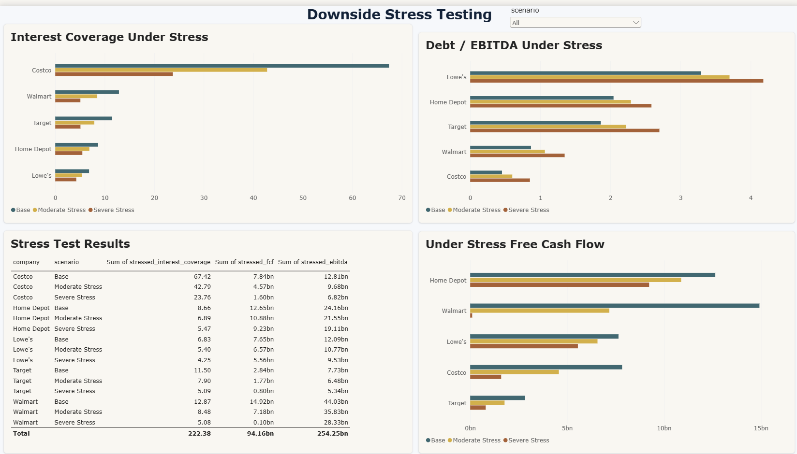
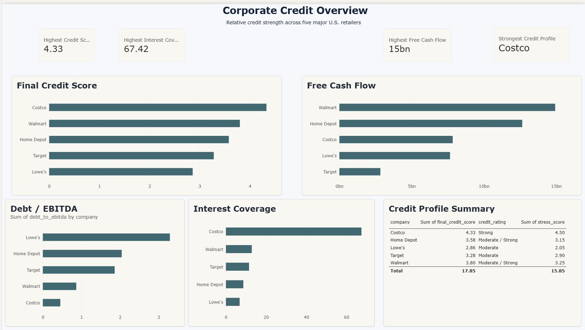

# Corporate Credit & Debt Capacity Analysis

A corporate credit analysis project evaluating the debt repayment capacity and credit risk of five major U.S. retailers using SEC financial data, SQL-based credit metrics, stress testing, Excel modeling, and Power BI.

## Business Question

If a bank were considering lending to Walmart, Target, Costco, Home Depot, and Lowe's, which companies demonstrate the strongest ability to repay debt and which carry greater credit risk?

## Companies Analyzed

* Walmart
* Target
* Costco
* Home Depot
* Lowe's

## Tools

**Python | pandas | SEC EDGAR | DuckDB | SQL | Excel | Power BI**

## Data & Methodology

Collected and standardized five years of financial statement data from SEC filings.

The final dataset contains 25 company-year observations covering:

* Revenue
* Operating Income
* Net Income
* Cash
* Current Assets
* Current Liabilities
* Total Assets
* Total Debt
* Shareholders' Equity
* Operating Cash Flow
* Capital Expenditure
* Interest Expense
* Depreciation & Amortization

Python was used for data extraction, cleaning, XBRL tag validation, and preparation. DuckDB and SQL were then used to calculate credit metrics and perform peer comparisons.

## Credit Metrics

The analysis evaluates:

* Revenue Growth
* Operating Margin
* Free Cash Flow
* Current Ratio
* Debt-to-Equity
* Interest Coverage
* EBITDA
* Debt / EBITDA
* Operating Cash Flow / Debt
* Free Cash Flow / Debt
* Cash Flow Stability

Negative shareholders' equity is treated as a leverage risk rather than allowing a negative Debt-to-Equity ratio to artificially improve the credit profile.

## Credit Scoring Model

Each company was evaluated across:

* Leverage
* Interest Coverage
* Liquidity
* Free Cash Flow
* Cash Flow Stability
* Profitability
* Performance Under Stress

The scoring model produces a relative credit score from 1 to 5.

These scores are analytical outputs created for this project and are not external credit-agency ratings.

## Stress Testing

Three scenarios were modeled to evaluate debt-service resilience.

| Scenario        | Revenue Shock | Margin Shock | Interest Expense |
| --------------- | ------------: | -----------: | ---------------: |
| Base            |            0% |         0 pp |               0% |
| Moderate Stress |           -5% |        -1 pp |             +10% |
| Severe Stress   |          -10% |        -2 pp |             +20% |

For each scenario, the model recalculates:

* Revenue
* EBIT
* EBITDA
* Operating Cash Flow
* Free Cash Flow
* Interest Coverage
* Debt / EBITDA
* Free Cash Flow / Debt

## Final Credit Ranking

| Rank | Company    | Credit Score | Rating            |
| ---: | ---------- | -----------: | ----------------- |
|    1 | Costco     |         4.33 | Strong            |
|    2 | Walmart    |         3.80 | Moderate / Strong |
|    3 | Home Depot |         3.58 | Moderate / Strong |
|    4 | Target     |         3.28 | Moderate          |
|    5 | Lowe's     |         2.86 | Moderate          |

## Key Findings

**Costco** demonstrated the strongest overall credit profile. Its low leverage, exceptional interest coverage, strong cash generation, and resilience under severe stress produced the highest score.

**Walmart** ranked second, supported by strong free cash flow, low Debt / EBITDA, and substantial operating cash flow relative to debt.

**Home Depot** maintained strong profitability and cash generation but carried materially higher leverage than Costco and Walmart.

**Target** showed manageable leverage and adequate debt-service coverage, but weaker revenue growth and free cash flow reduced its relative score.

**Lowe's** ranked lowest in the peer group. Although operating profitability remained strong, negative shareholders' equity, higher Debt / EBITDA, and weaker severe-stress performance increased its credit risk.

## Excel Credit Model

The Excel model contains:

* Historical Financials
* Credit Metrics
* Credit Scores
* Scenario Analysis

The scenario model uses Excel formulas to recalculate EBITDA, operating cash flow, free cash flow, interest coverage, and leverage under Base, Moderate Stress, and Severe Stress assumptions.

## Power BI Dashboard

The Power BI report contains four pages:

1. **Corporate Credit Overview**
   Credit rankings, free cash flow, leverage, interest coverage, and credit ratings.

2. **Financial Performance Trends**
   Five-year trends in revenue, operating margin, free cash flow, and total debt.

3. **Leverage, Liquidity & Debt Service**
   Debt / EBITDA, interest coverage, current ratio, and operating cash flow relative to debt.

4. **Downside Stress Testing**
   Base, Moderate Stress, and Severe Stress comparisons across debt-service metrics.

## Dashboard Preview

### Corporate Credit Overview



### Downside Stress Testing



## Project Structure

```text
Corporate_Credit_Analysis/
├── dashboard/
│   ├── Corporate_Credit_Analysis.pbix
│   └── data/
├── data/
│   ├── raw/
│   └── processed/
│       ├── financials.csv
│       └── credit_analysis.duckdb
├── excel/
│   └── credit_model.xlsx
├── images/
│   ├── credit_overview_dashboard.png
│   └── stress_testing_dashboard.png
├── notebooks/
│   ├── 01_data_collection.ipynb
│   ├── 02_data_cleaning.ipynb
│   └── 03_credit_analysis.ipynb
├── sql/
│   └── analysis.sql
└── README.md
```

## Workflow

```text
SEC Financial Filings
        ↓
Python Data Collection
        ↓
Data Cleaning & XBRL Validation
        ↓
25-Row Historical Financial Dataset
        ↓
DuckDB + SQL Credit Analysis
        ↓
Credit Scoring & Stress Testing
        ↓
Excel Credit Model
        ↓
Power BI Dashboard
```
